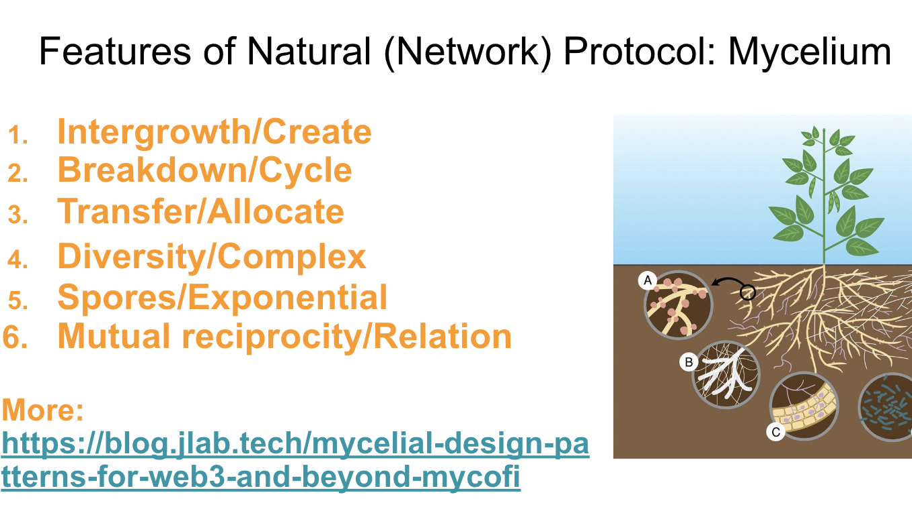

# Mushroom DAO :mushroom:
Hey, we are launching a Mushroom DAO and cooperation with Mycelium Protocol.

<iframe src="mushroom-dao-banner.html" width="400" height="300"></iframe>

[中文](./README_zh.md)

## What is Mushroom DAO?
Mushroom DAO is a decentralized autonomous organization (DAO), which is researching, developing and launching **new economics models** on blockchain.
We practice the innovations beyond the Defi on blockchain: a **new cooperation network** and some **new cooperation ways**.
We think blockchain should create new cooperations and **help normals improve their well-being**, not only a new financial investment platform.

### Infrastructure
We create AirAccount, SuperPaymaster, SDSS(Standard Decentralized Service System, Rain Computing), and more.
We have AAStar team, who are working on the infrastructure construction.

### Protocol
We create jLab years ago, researching on HyperCapital after the individual value research and more.
We learn from the Nature and Mycelium a lot, trying to practice the innovations guided by the Nature.

### CMUBRC/CMUBA
We create CMUBA(Chiang Mai University Blockchain Association), a pre-state of CMUBRC(Chiang Mai University Blockchain Research Center, plan), trying to research on academic and industry together.
We publish and working on some topics and papers.

### DAO/Community
We are trying to create a DAO, MushRoom DAO, it is a open community.
MushRoom DAO will initiate the Mycelium Protocol, and run the Mycelium Protocol.
We will create a real organization in Dubai, and run the real organization.

### Company
We invent a new simple way: create a company for efficiency on initiating a DAO.
And help the DAO to run real world business cooperation with benefits sharing.
We call this company HyperCapital, holding the DAO 20% GToken without any revenue.
The only way to get business return is to help the DAO growing and invest the real project in business layer to get return.

## What is Mycelium Protocol?
Mycelium Protocol is a cooperation protocol inspiring by the nature and diversity fungi relations, it is built on the Ethereum blockchain.

## What is the relationship between Mushroom DAO and Mycelium Protocol?
Mushroom DAO is a instance of Mycelium Protocol, and an initial protocol builder.
One is theoretical, the other is practical.

## What we need?
**Complaints and grievances are less effective than taking action.**
Now we need researchers, developers, designers, and more.

But, read the [White Paper](./whitepaper-en.md) first.

## What we can do?
Create some cooperation innovations following the Nature's way like Mycelium.

## What we can get?
Create the value and get return for your contribution.
