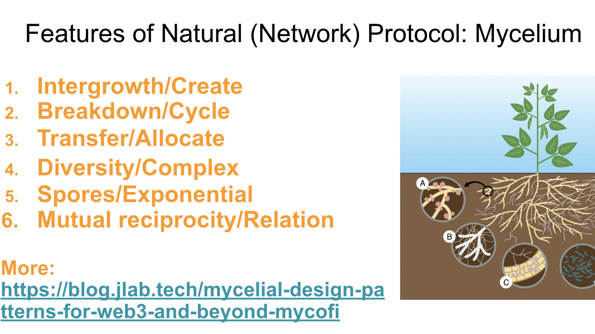

# Mushroom DAO :mushroom:
Hi，这里是构建于 Mycelium 协议之上的蘑菇 DAO。

<iframe src="mushroom-dao-banner.html" width="400" height="300"></iframe>

[English](README.md)

## What is Mushroom DAO?

Mushroom DAO 是一个去中心化的组织，致力于在区块链上构建和推出**新的经济范式**。我们的工作探索了超越 DeFi 的创新，通过**培养新的合作网络和方法**来实现。我们设想一个区块链，它**赋能人们并改善生活**，超越其作为金融投机工具的角色。

### Infrastructure
我们创建了 AirAccount、SuperPaymaster、SDSS（标准去中心化服务系统，雨计算）等。
我们有 AAStar 团队和 CMUBA（清迈大学区块链协会），正在构建基础设施和相关应用。

### Protocol
我们多年前创建了 jLab，在研究了个人价值之后，我们开始研究**HyperCapital**。
我们从自然和 Mycelium 中学到了很多，试图实践由自然指导的创新。
因此，我们启动了 **Mycelium 协议**，并运行 Mycelium 协议。

### CMUBRC/CMUBA
我们创建了 CMUBA（清迈大学区块链协会），一个 CMUBRC（清迈大学区块链研究中心，计划）的预状态，试图共同研究学术和行业。
我们发布和正在研究一些主题和论文。

### DAO/Community
我们正在尝试创建一个 DAO，蘑菇 DAO，它是一个开放的社区。
蘑菇 DAO 将启动 Mycelium 协议，并运行 Mycelium 协议。
我们将在迪拜创建一个真正的 DAO 组织，并持续运行。

### Company
我们发明了一种新的简单方法：创建一个公司来提高 DAO 的效率。
并帮助 DAO 运行现实世界的业务合作，分享利益。
我们称这个公司为 HyperCapital，持有 DAO 20% GToken。
唯一获得业务回报的方法是帮助 DAO 增长，并将真实项目投资到业务层以获得回报。

## What is Mycelium Protocol?
Mycelium 协议是受自然和多样真菌关系启发的合作协议，构建在以太坊区块链上。

## What is the relationship between Mushroom DAO and Mycelium Protocol?
蘑菇 DAO 是 Mycelium 协议的一个实例，是初始协议构建者。
它是一个理论，一个实践。

## What we need?
**抱怨和不满不如行动。**
我们现在需要研究人员、开发人员、设计师等。

但是，先阅读 [白皮书](./whitepaper-en.md)。

## What I can do?
创建一些合作创新，遵循自然的方式，如 Mycelium。
了解更多关于 Mycelium 协议和蘑菇 DAO 的信息。
订阅 [蘑菇 Substack](https://mushroomdao.substack.com/)

## What we can get?
创造价值并获得回报。
