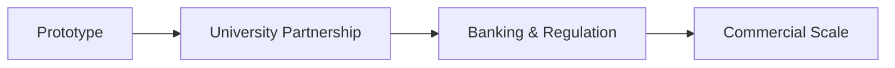
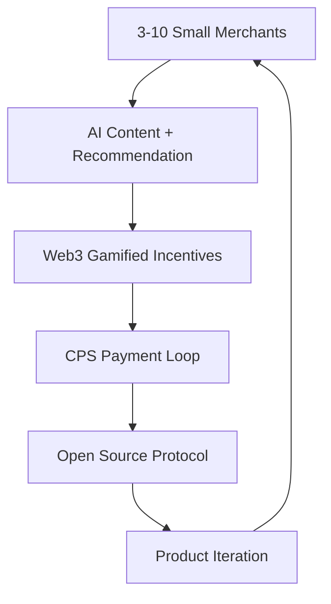
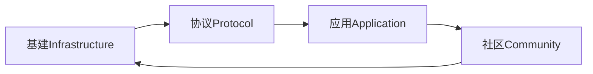

# Mycelium Protocol - Lite White Paper
**Author:** Jason Jiao  
**Date:** January 2025  
**Version:** 0.2.0

---

## Abstract

风起于青萍之末，浪成于微澜之间。

Mycelium Protocol 是一个去中心化的协作创新协议，旨在通过双路径策略重新定义价值分配，让普通人重获想象力、创造力和情感主导权。

借鉴真菌 45+ 亿年的协作创新模式，我们提出两条并行发展路径：
- **自顶向下**：与机构合作的规模化路径
- **自底向上**：微循环经济的去中心化路径

**核心价值主张：** 零认知成本接入 + AI 内容推荐 + Web3 游戏化激励 + 开源可持续协议

---

## 1. Vision & Mission

### Vision
通过协议网络，重新定义价值和分配，让普通人创建自己的协作和涌现。

### Mission  
为每个人提供一个去中心化的数字经济参与方式，无论是通过机构合作还是微循环自组织。

### Core Philosophy
不是革命宣言，也不是颠覆尝试，而是对未来的一种探索：**原来你还可以这样选择。**

---

## 2. Dual-Path Strategy

### Path A: Institution Partnership (Top-Down)

**Timeline:** 2025-2028  
**Target:** 规模化应用，合规运营

### Path B: Micro-circulation Model (Bottom-Up)

**Timeline:** 2025-2026 (并行进行)  
**Target:** 自维持微观经济生态

---

## 3. Technical Architecture

### Fungal-Inspired Design Principles
基于真菌 45+ 亿年协作创新的六大核心原则：
- **共生创造 (Symbiosis & Creation)** - 多方共赢的价值创造
- **循环分解 (Cycle & Breakdown)** - 价值的持续循环和转化
- **传输分配 (Transfer & Allocation)** - 高效的价值传输网络
- **多样复杂 (Diversity & Complexity)** - 支持多元化生态
- **指数增长 (Exponential & Spores)** - 网络效应驱动的增长
- **互惠互利 (Mutual Reciprocity)** - 可持续的激励机制

### Three-Layer Architecture

#### 3.1 Infrastructure Layer (基础 Infra 组件)
- **AirAccount：** 基于 ERC4337 的无门槛智能合约账户 (Passkey+MFA+TEE)
- **SDSS (雨计算协议)：** 去中心化计算和存储网络
- **SuperPaymaster：** 无 Gas 体验的交易赞助系统
- **协议支持：** ERC4337, EIP7702, RIP7560, BLS with DVT

#### 3.2 Protocol Layer (核心协议群组件)
- **Doris 协议：** 创作者经济和内容价值循环
- **Chiang Mai Connect：** 本地信息搜索发现协议
- **OpenPNTs/OpenCards：** 社区积分和身份系统
- **HyperCapital：** 超资本经济模型，重新定义价值计算

#### 3.3 Application Layer (应用框架组件)
- **COS72：** DAO/社区工具和DApp开发框架
- **Arcadia：** Play2B2E 客户忠诚度链上积分系统
- **Web3 SSO：** 一键登录的身份聚合服务
- **OpenNest：** 去中心化孵化协议

---

## 4. HyperCapital Economic Model

### Core Economic Philosophy
HyperCapital 重新定义了价值计算方式：**不仅是拥有资本的人才能参与价值创造，而是所有贡献者都能获得相应收益。**

### Revenue Streams
1. **Gas 优化费用：** 10% 的 gas 赞助费 (SuperPaymaster)
2. **NFT 交易费用：** 5% 的移动端 NFT 铸造销售费
3. **隐私数据价值：** "Touch me" - 精准隐私 PCD 数据付费
4. **选择权货币化：** "Will power" - 意愿力和选择权变现
5. **游戏挖矿：** "Meme 经济" - 永续游戏挖矿收益
6. **生态产品：** COS72, Arcadia, zuCoffee, HexagonWarrior

### Basic Income (BI) Vision
通过协议网络为个体提供基础收入，目标实现：
- **人人有区块链账户** 提升福祉
- **社区传播基础收入** 成为主流
- **DeSci, DeFi, DApps** 改变分配方式，引领文化

### Dual-Token System
- **GToken (治理代币)：** 网络治理和长期价值捕获
- **mPNTs (实用代币)：** 网络内交易和服务支付
- **社区 Points：** 各社区自主发行的积分系统

### Token Distribution & Circulation
- **参与即挖矿：** 贡献即收益的分配机制
- **5% 协议费：** 每个社区发行的 5% 归于协议公共池
- **循环经济：** 基于实际经济活动的价值锚定

---

## 5. Ecosystem Network

### 5.1 Fungal Network Structure
基于真菌网络的组织形态：
- **Forest (森林):** 社区节点网络 - 提供协议基础设施和治理
- **Spores (孢子):** 个体网络建设者 - 连接不同社区的桥梁节点
- **Trees (树木):** 无许可加入的个体用户 - 协议的最终受益者
- **Mycorrhizal (菌根):** Spores 与商业的新型合作关系网络

### 5.2 DPT Alignment (去中心化 - 无许可 - 无需信任)
- **Decentralized:** 无中心控制，社区自治
- **Permissionless:** 无需许可，自由参与
- **Trustless:** 无需信任，代码即法律

### 5.3 Continuous Innovation Cycle

### 5.4 六大关键指标 (Dashboard)
1. **Tribes:** 社区数量
2. **Mushrooms:** 注册成员数
3. **Spores:** 参与 Spores 计划人数
4. **Cooperations:** 总交易数量
5. **Revenue:** 所有成员获得的 PNTs 总量
6. **Assets:** 现实世界资产数量

---

## 6. Implementation Roadmap

### Phase 1: Prototype Validation (2025-2026)
**目标：** 技术可行性证明  
**产出：** 移动端 Demo + 技术白皮书 + 顾问认可

### Phase 1.1: Micro-circulation Model (2025-2026, Parallel)
**目标：** 微循环经济验证  
**产出：** 3-10 商户微循环 + 开源协议 + 持续迭代

### Phase 2: Feasibility Validation (2026-2027)
**目标：** 真实环境验证  
**产出：** CMU 沙盒报告 + 大学合作协议

### Phase 3: Legitimacy Validation (2026-2027)
**目标：** 监管合规确认  
**产出：** BOT 沙盒批准 + 银行合作协议

### Phase 4: Commercial Validation (2027-2028)
**目标：** 商业模式验证  
**产出：** 1000+ 活跃用户 + 盈利模型 + LTV>CAC

---

## 7. Risk Management

### Primary Risks
1. **监管阻力：** 通过微循环模型提供备选路径
2. **技术风险：** 渐进式技术栈，成熟协议组合
3. **市场接受度：** 双路径验证，降低单点失败风险
4. **竞争风险：** 开源协议，网络效应护城河

### Mitigation Strategy
**双保险机制：** 机构路径 + 微循环路径并行，确保至少一条路径可行

---

## 8. Conclusion

Mycelium Protocol 不是一个简单的技术项目，而是对未来数字经济形态的探索实验。

通过双路径策略，我们既追求规模化的影响力，也保持去中心化的初心。无论是与机构合作的自顶向下路径，还是微循环经济的自底向上路径，最终目标都是：

**让每个普通人在数字经济中拥有真正的选择权和价值获得能力。**

这是一个关于选择的故事：原来，你还可以这样生活，这样工作，这样创造价值。

---

**Contact:** @jasonjiao (telegram) 
**GitHub:** https://github.com/mushroomdao  
**Community:** https://x.com/mushroomdao1984 (twitter)

---
*License: GNU General Public License v3.0* 