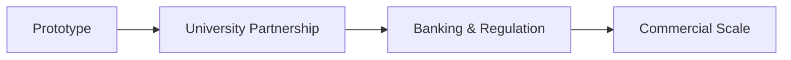
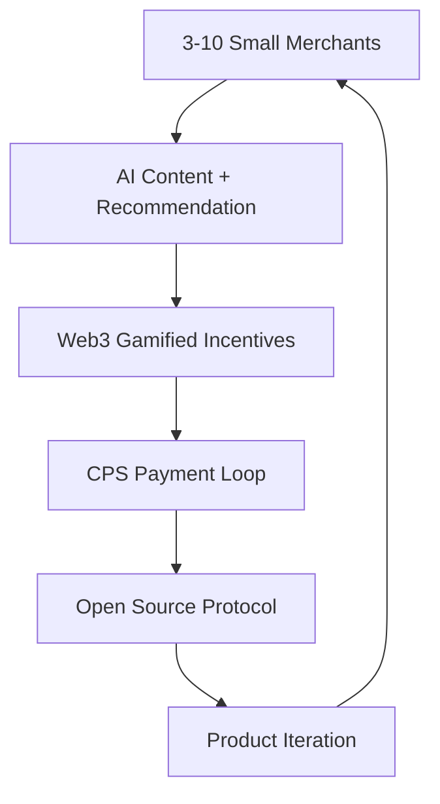
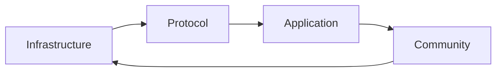

# Mycelium Protocol - Lite White Paper
**Author:** Jason Jiao  
**Date:** January 2025  
**Version:** 0.2.0
[中文版](./whitepaper-zh.md)
---

## Abstract

Like a gentle breeze rising from tranquil waters, innovation begins with the smallest changes.

Mycelium Protocol is a decentralized cooperative innovation protocol that redefines value distribution through a dual-path strategy, empowering ordinary people to reclaim their imagination, creativity, and emotional agency.

Inspired by 4.5+ billion years of fungal cooperative innovation, we propose two parallel development paths:
- **Top-Down:** Institutional partnership for scale
- **Bottom-Up:** Micro-circulation economy for decentralization

**Core Value Proposition:** Zero-friction onboarding + AI content recommendation + Web3 gamified incentives + Open sustainable protocol

---

## 1. Vision & Mission

### Vision
Redefine value and distribution through protocol networks, enabling ordinary people to create their own collaboration and emergence.

### Mission  
Provide everyone with a decentralized digital economy participation method, whether through institutional cooperation or micro-circulation self-organization.

### Core Philosophy
This is not a revolutionary manifesto or disruptive attempt, but an exploration of the future: **You can choose differently.**

---

## 2. Dual-Path Strategy

### Path A: Institution Partnership (Top-Down)

**Timeline:** 2025-2028  
**Target:** Scalable application, compliant operation

### Path B: Micro-circulation Model (Bottom-Up)

**Timeline:** 2025-2026 (Parallel execution)  
**Target:** Self-sustaining micro-economic ecosystem

---

## 3. Technical Architecture

### Fungal-Inspired Design Principles
Based on 4.5+ billion years of fungal cooperative innovation, six core principles:
- **Symbiosis & Creation** - Multi-party value creation
- **Cycle & Breakdown** - Continuous value circulation and transformation
- **Transfer & Allocation** - Efficient value transfer network
- **Diversity & Complexity** - Supporting diverse ecosystems
- **Exponential & Spores** - Network effect-driven growth
- **Mutual Reciprocity** - Sustainable incentive mechanisms

### Three-Layer Architecture

#### 3.1 Infrastructure Layer
- **AirAccount:** ERC4337-based frictionless smart contract accounts (Passkey+MFA+TEE)
- **SDSS (Rain Computing):** Decentralized computing and storage network
- **SuperPaymaster:** Gas-free transaction sponsorship system
- **Protocol Support:** ERC4337, EIP7702, RIP7560, BLS with DVT

#### 3.2 Protocol Layer
- **Doris Protocol:** Creator economy and content value circulation
- **Chiang Mai Connect:** Local information discovery protocol
- **OpenPNTs/OpenCards:** Community points and identity systems
- **HyperCapital:** Redefining value calculation models

#### 3.3 Application Layer
- **COS72:** DAO/Community tools and DApp development framework
- **Arcadia:** Play2B2E customer loyalty on-chain point system
- **Web3 SSO:** One-click identity aggregation service
- **OpenNest:** Decentralized incubation protocol

---

## 4. HyperCapital Economic Model

### Core Economic Philosophy
HyperCapital redefines value calculation: **Not only capital owners can participate in value creation, but all contributors can receive corresponding returns.**

### Revenue Streams
1. **Gas Optimization Fee:** 10% gas sponsorship fee (SuperPaymaster)
2. **NFT Trading Fee:** 5% mobile NFT minting and sales fee
3. **Privacy Data Value:** "Touch me" - Precise privacy PCD data payments
4. **Choice Monetization:** "Will power" - Willpower and choice monetization
5. **Gaming & Mining:** "Meme Economy" - Perpetual gaming mining revenue
6. **Ecosystem Products:** COS72, Arcadia, zuCoffee, HexagonWarrior

### Basic Income (BI) Vision
Provide basic income for individuals through protocol networks, aiming to achieve:
- **Everyone has blockchain accounts** to improve well-being
- **Community-spread basic income** becomes mainstream
- **DeSci, DeFi, DApps** change allocation methods and lead culture

### Dual-Token System
- **GToken (Governance Token):** Network governance and long-term value capture
- **PNTs (Utility Token):** In-network transactions and service payments
- **Community Points:** Independently issued point systems by communities

### Token Distribution & Circulation
- **Participate to Mine:** Distribution mechanism where contribution equals rewards
- **5% Protocol Fee:** 5% of each community's issuance goes to protocol public pool
- **Circular Economy:** Value anchored to real economic activities

---

## 5. Ecosystem Network

### 5.1 Fungal Network Structure
Based on fungal network organizational forms:
- **Forest:** Community node network - Providing protocol infrastructure and governance
- **Spores:** Individual network builders - Bridge nodes connecting different communities
- **Trees:** Permissionless individual users - Final beneficiaries of the protocol
- **Mycorrhizal:** New cooperative relationship network between Spores and businesses

### 5.2 DPT Alignment (Decentralized-Permissionless-Trustless)
- **Decentralized:** No central control, community self-governance
- **Permissionless:** No permission needed, free participation
- **Trustless:** No trust required, code is law

### 5.3 Continuous Innovation Cycle

### 5.4 Six Key Metrics (Dashboard)
1. **Tribes:** Number of communities
2. **Mushrooms:** Number of registered members
3. **Spores:** Number of Spores plan participants
4. **Cooperations:** Total number of transactions
5. **Revenue:** Total PNTs earned by all members
6. **Assets:** Number of real-world assets

---

## 6. Implementation Roadmap

### Phase 1: Prototype Validation (2025-2026)
**Goal:** Technical feasibility proof  
**Output:** Mobile Demo + Technical Whitepaper + Advisor Approval

### Phase 1.1: Micro-circulation Model (2025-2026, Parallel)
**Goal:** Micro-circulation economy validation  
**Output:** 3-10 merchant micro-loop + Open source protocol + Continuous iteration

### Phase 2: Feasibility Validation (2026-2027)
**Goal:** Real environment validation  
**Output:** CMU Sandbox Report + University Partnership Agreement

### Phase 3: Legitimacy Validation (2026-2027)
**Goal:** Regulatory compliance confirmation  
**Output:** BOT Sandbox Approval + Banking Partnership Agreement

### Phase 4: Commercial Validation (2027-2028)
**Goal:** Business model validation  
**Output:** 1000+ active users + Profit model + LTV>CAC

---

## 7. Risk Management

### Primary Risks
1. **Regulatory Resistance:** Micro-circulation model provides alternative path
2. **Technical Risk:** Progressive tech stack, mature protocol combination
3. **Market Acceptance:** Dual-path validation, reducing single point of failure risk
4. **Competition Risk:** Open source protocol, network effect moat

### Mitigation Strategy
**Dual Insurance Mechanism:** Institutional path + micro-circulation path in parallel, ensuring at least one viable path

---

## 8. Conclusion

Mycelium Protocol is not simply a technical project, but an experimental exploration of future digital economic forms.

Through dual-path strategy, we pursue both scalable impact and maintain decentralized principles. Whether through top-down institutional cooperation or bottom-up micro-circulation economy, the ultimate goal remains:

**Enable every ordinary person to have real choice and value acquisition capability in the digital economy.**

This is a story about choice: You can live differently, work differently, and create value differently.

---

**Contact:** @jasonjiao (telegram)  
**GitHub:** https://github.com/mushroomdao  
**Community:** https://x.com/mushroomdao1984 (twitter)

---
*License: GNU General Public License v3.0* 